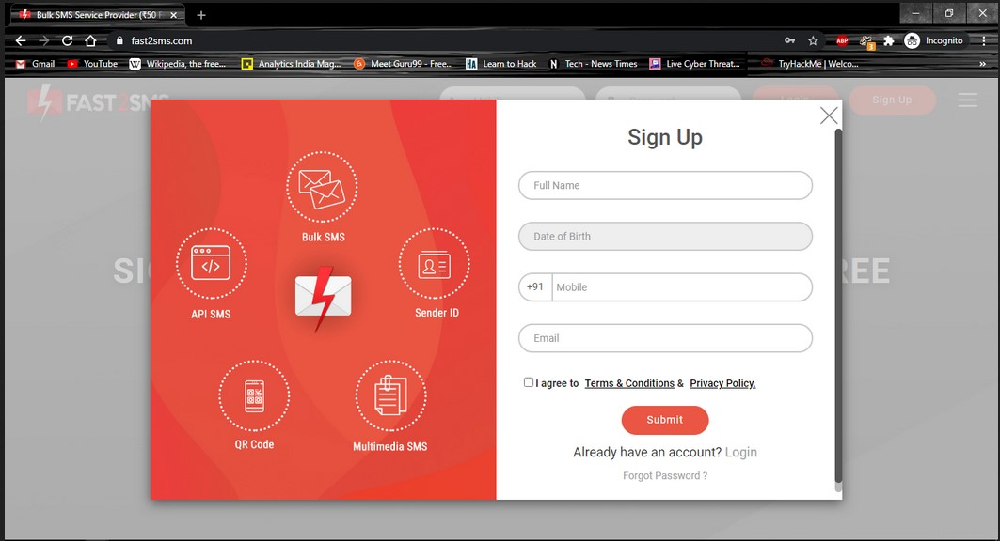
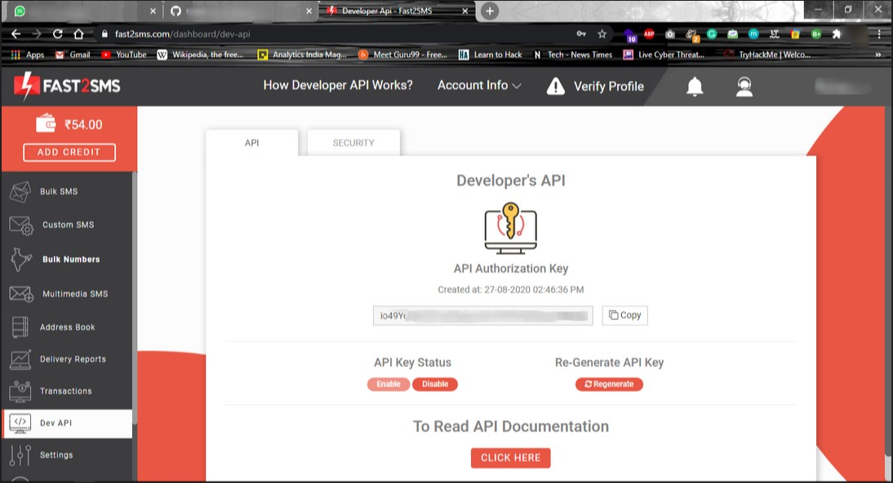
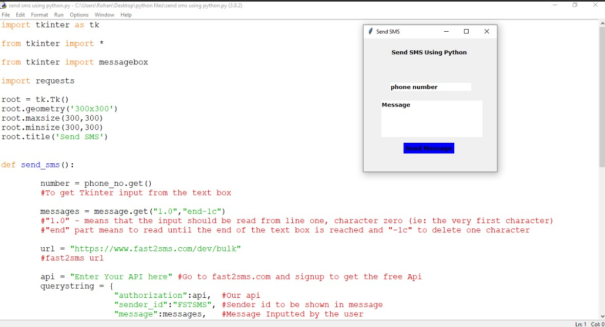

# send-sms-using-python

Using this python program we send message to a specified number

##Procedure##
1)Open [fast2sms](https://www.fast2sms.com/) website and signup using your mobile number

2)In dashboard go to DEV-API

3)copy the API key and paste it in the code  

4)run the code and send sms by inputting your mobile number and message

5)Check Your Phone for the message

